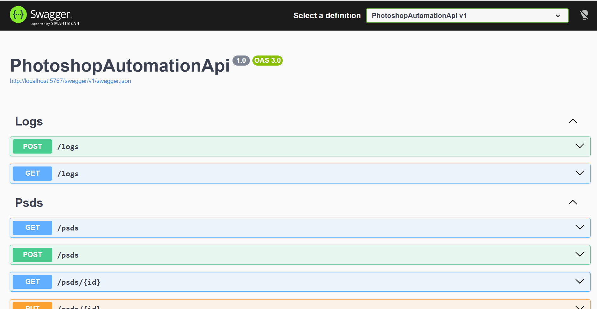
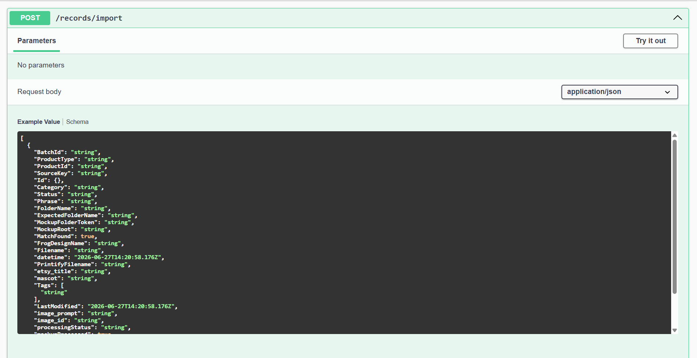
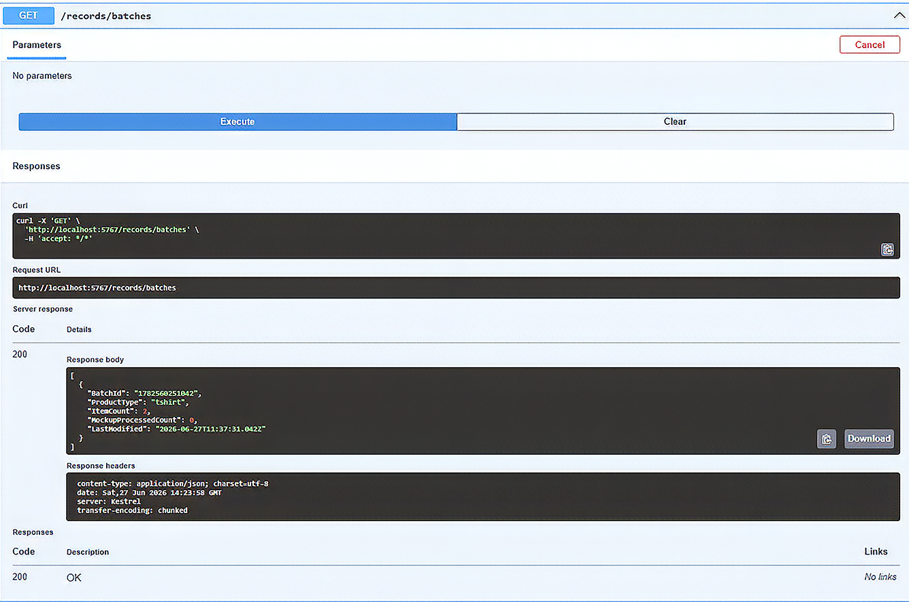

# PhotoshopAutomation.Api

A REST API for managing batch-based print-on-demand (POD) product workflows.

PhotoshopAutomation.Api serves as the orchestration layer for the Mockup Workflow platform, coordinating product imports, MongoDB persistence, batch management, and communication between supporting services.
---

## Features

### Batch Import

Import POD items from JSON.

During import the API:

* Stores product records in MongoDB
* Prevents duplicate imports using SourceKey
* Assigns workflow metadata
* Supports multiple product types

### Batch Management

Products are organized into batches.

Each batch contains:

* Batch ID
* Product Type
* Product records
* Processing status

Batch summaries can be queried to monitor workflow progress.

### Workflow Integration

The API integrates with:

* MockupWorkflow.Admin
* FolderCreator.API
* MongoDB
* Shared domain models

---

## REST Endpoints

### Import Records

```http
POST /records/import
```

Imports POD items into MongoDB.

---

### Ready Records

```http
GET /records/ready
```

Returns products ready for processing.

---

### Batch Summary

```http
GET /records/batches
```

Returns one summary per batch including:

* Batch ID
* Product Type
* Item Count
* Mockup Progress
* Last Modified

---

## Architecture

## Architecture

*Architecture diagram coming soon.*

PhotoshopAutomation.Api serves as the central orchestration service for the Mockup Workflow platform. It coordinates batch imports, MongoDB persistence, and communication with supporting services including MockupWorkflow.Admin and FolderCreator.API.

---

## Technology Stack

* ASP.NET Core
* REST APIs
* MongoDB
* Docker
* C#
* .NET 10

---

## Related Projects

### MockupWorkflow.Admin

Blazor administration portal.

### FolderCreator.API

Creates batch folder structures for imported products.

### MockupWorkflow.Shared

Shared business models and MongoDB collections.

---

## Current Workflow

1. Receive imported products
2. Validate SourceKeys
3. Store products
4. Organize into batches
5. Provide batch summaries
6. Coordinate downstream processing

---

## Roadmap

* Mockup generation endpoints
* Batch processing pipeline
* Progress reporting
* Printify integration
* Workflow monitoring
* Asset management

---

## Project Status

Active development.

Current focus is expanding the API into a complete workflow orchestration service supporting automated product creation.

---

## Screenshots

### Swagger Overview



### Import Endpoint



### Batch Management Endpoint

